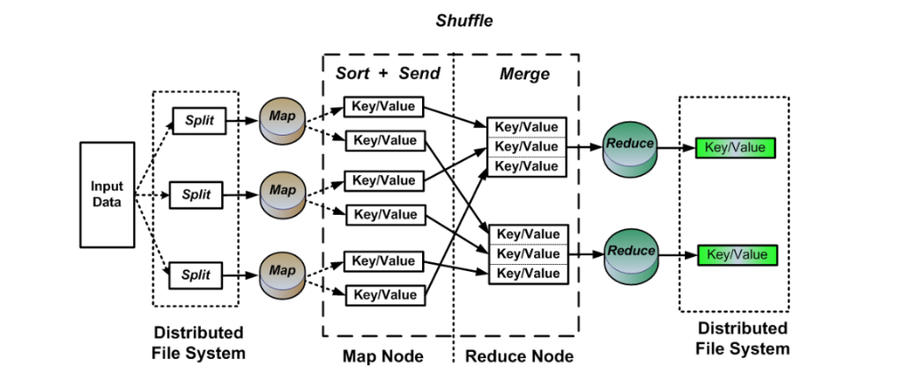

# Map Reduce 3

## Reduce Write

- wordcount 예시
  - 셔플링 과정을 마친 데이터를 각각의 리듀서가 읽어온 후 단어별 개수 카운팅 완료. 그 결과는 파일 형태로 출력된다.
    - 여기서 문제가 또 생긴다. 
    - 리듀서들 역시 분산된 노드들이라 리듀스 결과 데이터가 분산되어있다는 것.
    - 이를 다시 어떻게 취합하여 저장할까?
  - 아래 다이어그램을 통해 리듀스 결과를 마친 데이터가 어떻게 저장되는 지 확인 가능.

- MapReduce는 reduce 결과로 생성된 Key Value 값들을 별도로 취합하지 않고 input file을 쪼개어 저장했을 때 처럼 분산 파일 시스템에 저장. 
- 장점
  1. reduce 결과물들을 다시 취합해야하는 수고를 덜어주고, 결과 데이터들을 가지고 다시 MapReduce 작업을 진행하기가 편리 
  2. 읽기 작업을 수행할 때에는 분산 파일 시스템이 이 역할을 해주게 되어 MapReduce 자체의 구현이 더 간결해진다.

**1. Inverted Index**

· map: 웹 문서 데이터 청크를 입력 받아서 파싱한 다음 word(K): document ID(V) 형태의 데이터를 만듭니다.

· reduce: 앞서 구한 K/V 데이터를 입력 받아서 다음과 같은 형태로 합쳐줍니다. word: list(document ID) 특정 단어가 쿼리로 들어오면 이렇게 구한 list(documentID)를 리턴해주면 간단한 검색 엔진을 구현할 수 있습니다.

**2. Distributed Sort**

· map: 레코드에서 소팅의 기준이 되는 키 값을 골라내어 key(K): record(V) 형태의 데이터를 만듭니다.

· reduce: 리듀스에서는 앞서 구한 K/V를 그대로 합쳐주어 파일에 저장합니다. 왜냐하면 Map 함수를 거쳐 생성한 intermediate file 들은  이미 소팅이 되어 있기 때문입니다.

### 맵리듀스의 한계

### 1. 복잡한 셔플링

Map과 Reduce 과정은 상당히 단순함, 하지만 이것을 연결하는 Shuffling 과정이 복잡하여 속도가 느려짐. 그래서 하둡 엔지니어들 사이에선 MapReduce를 small Map, large Shuffle, small Reduce라 불러야 한다는 조크가 있다는 후문이...

### 2. 잦은 파일 입출력

각각의 노드들은 map이나 Reduce 작업을 하기 위해 파일을 읽고 쓰는 작업을 한다. Mapper는 분산 파일 시스템에서 데이터를 읽어와 intermediate key value를 생성한 후, 자신의 디스크 공간에 파일을 쓴다. Reducer는 다시 이 파일을 읽어와 리듀스 작업을 진행한 후 결과 파일을 분산 파일 시스템에 출력. 이렇게 반복적인 disk I/O는 성능 저하의 원인이 되며, 추후 spark가 이러한 문제점을 해결하기 위해 메모리 단에서 연산을 수행하는 방식을 제안하게 되었다고 한다.

#### Apache Spark란?

Apache Spark는 SQL, 스트리밍, 머신러닝 및 그래프 처리를 위한 기본 제공 모듈이 있는 대규모 데이터 처리용 통합 분석 엔진. Spark는 클라우드의 Apache Hadoop, Apache Mesos, Kubernetes에서 자체적으로 실행될 수 있으며 다양한 데이터 소스에 대해 실행될 수 있다. 

https://cloud.google.com/learn/what-is-apache-spark?hl=ko

Hadoop은 주로 디스크 사용량이 많고 맵리듀스 패러다임을 사용하는 작업에 사용. Spark는 더 유연하지만 대체로 더 많은 비용이 드는 인메모리 처리 아키텍처.